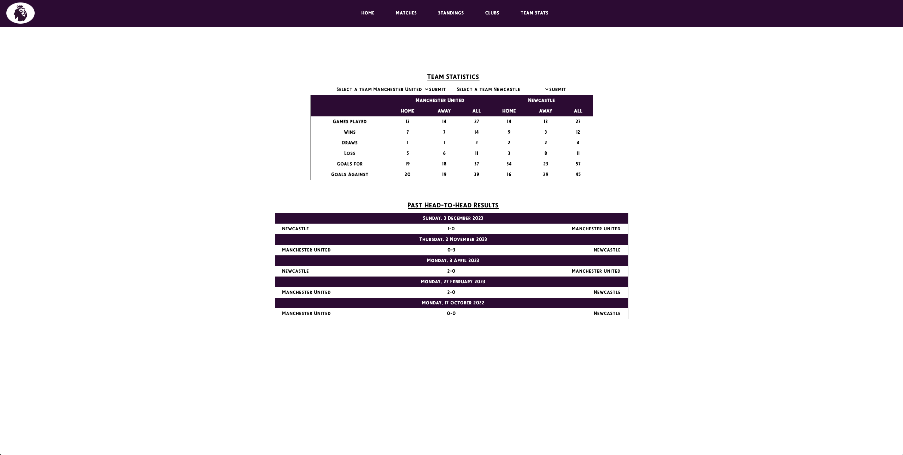

# Kickoff Analysis | React application
Welcome to Kickoff Analysis! An application built with react and axios where users can view EPL match fixtures, standings and team stats.

:point_right: **Live Project:** [Click here to view my project on Surge!](https://kickoff-analysis.surge.sh/)

## Table of contents
- [Overview](#page_facing_up-overview)
  - [Screenshots](#screenshots)
  - [Wireframe/References](#wireframereferences)
  - [Links](#link-links)
- [My process](#bulb-my-process)
  - [Built with](#built-with)
  - [Key takeaways](#key-takeaways)
  - [Personal challenges](#personal-challenges)
- [Future development](#future-deployment)

## :page_facing_up: Overview
### Screenshots

### Wireframe/References

### :link: Links
- **Github:** [https://github.com/christianleong/react-football](https://github.com/christianleong/react-football)
- **Surge:** [https://kickoff-analysis.surge.sh/](https://kickoff-analysis.surge.sh/)

## :bulb: My process
### Built with
- HTML
- CSS
- JavaScript
- Flexbox
- Axios
- Tailwind CSS
- React

### Key takeaways
- Having an idea, wireframe and reference is important to building the app.
- Plan the features out on trello board, from broad strokes to fine tuning minor details.
- Understanding tailwind CSS takes time.
- Feedback and sharing ideas is helpful for improving on the project.
- Learnt how to create a function to listen if the bottom of the screen has been reached. 
- Learnt how to use React Routers.
- Learnt how to convert a string into (hero)icons.
### Personal challenges
- Building the table, but understood it after dt explained.
- HTML structure is important, because I started off with tailwind Navbar and wanted to keep that in every page, so I kept some of the div that came with the Hero layout but it become confusing keeping track what HTML elements are in which box.
## :triumph: Future deployment
- Add localstorage to allow users to store id of favourite teams, and fetch the team stats.
- Add links to cards, hover effect and right arrow on bottom right corner.
- Add more stats to the team stats page.
- Add filters (by season, matchweek) to standings page to change the season.
- Show live matches on upcoming fixtures, while still only listing 15 on each side.
- Add colours to teams on the standings page to highlight the top four and the last few at risk of relegation.
- Add upper green arrow and downwards red arrow for teams that moved on the standings table.
- Add a dropdown to the teams on the standings table to show the last result, next game's timing and previous performance in a chart.
Add modal to match list page to view the current standings, last 2 results in previous meeting, and each teams' 5 previous results. of the two teams.